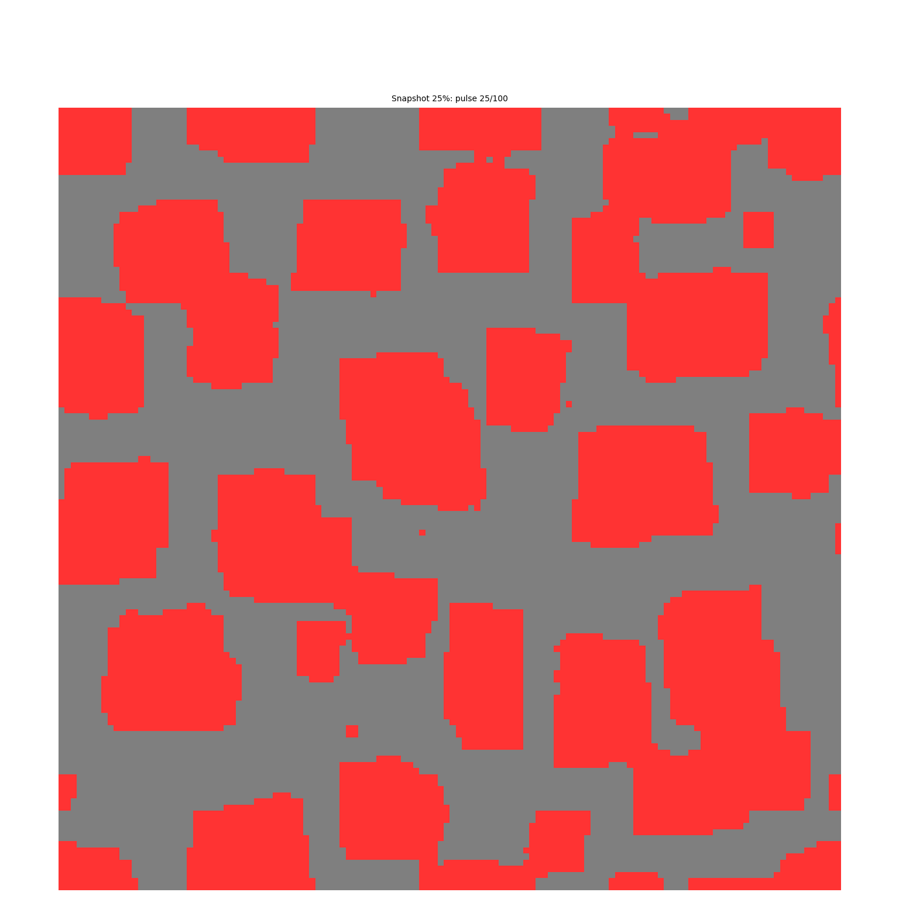
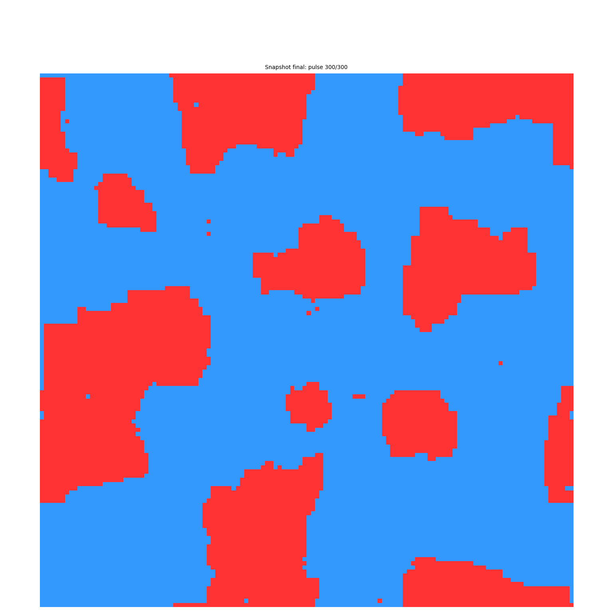
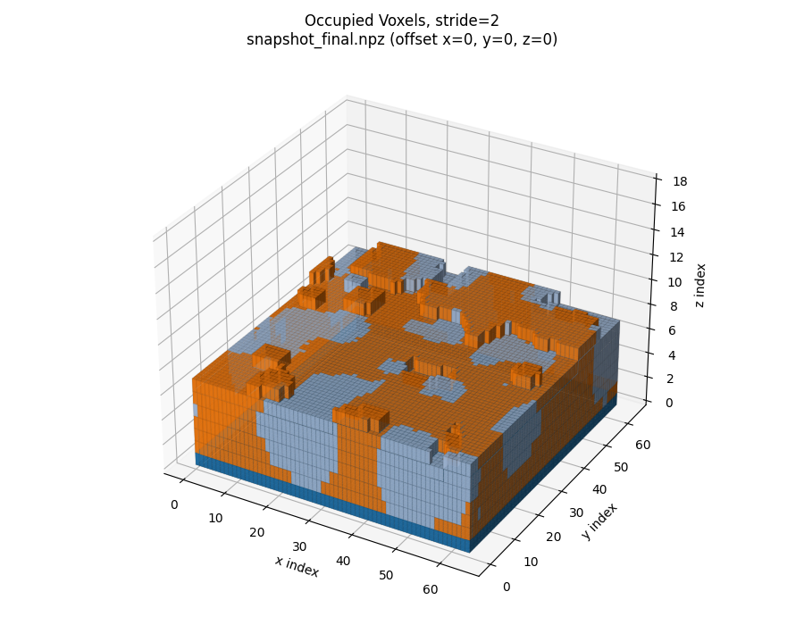
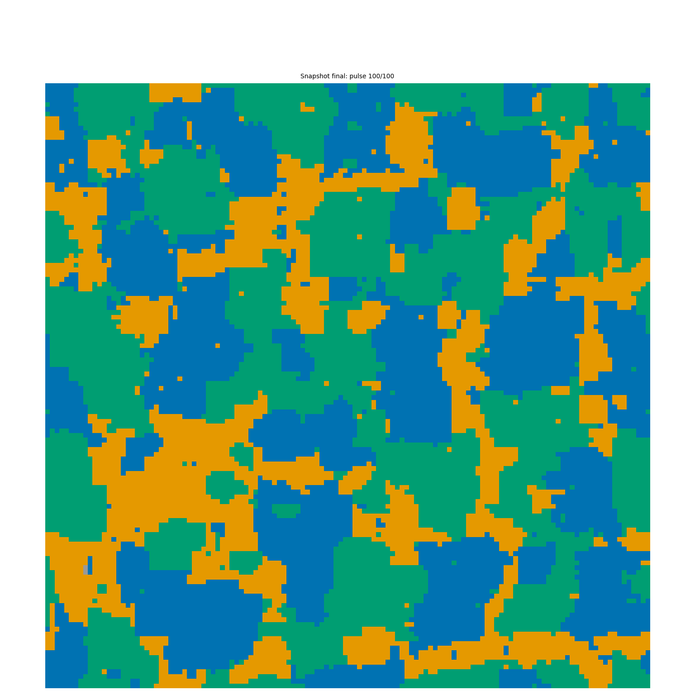
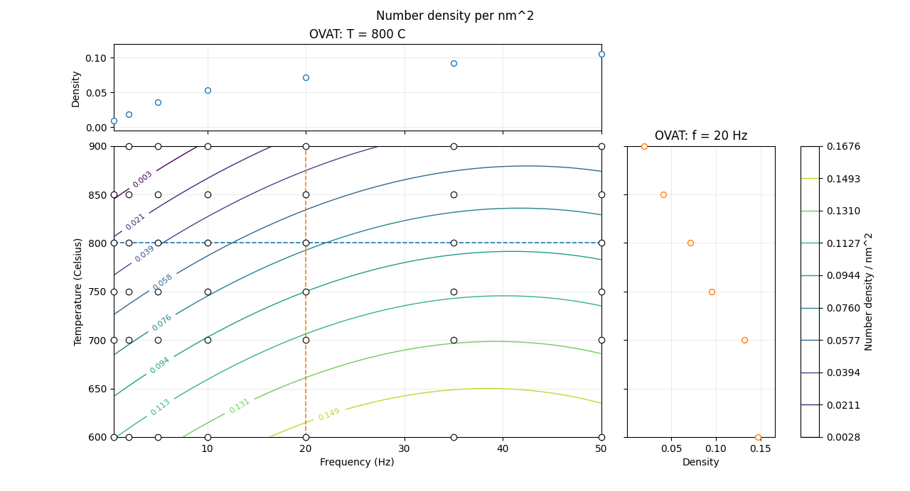

# KMCS - Kinetic Monte Carlo Simulation of Multi-Material Thin-Film Growth

KMCS is a lattice-based kinetic Monte Carlo model for simulating pulsed thin-film growth, with a particular focus on vertically aligned nanocomposites (VANs). The model can also be used to study the growth of individual materials.

This Python implementation is an adaptation of the MATLAB code used in our publication:

> D. M. Cunha, C. M. Vos, T. A. Hendriks, D. P. Singh, and M. Huijben, "Morphology Evolution during Lithium-Based Vertically Aligned Nanocomposite Growth," *ACS Applied Materials & Interfaces* **11** (2019), 44444-44450.  
> [https://doi.org/10.1021/acsami.9b15025](https://doi.org/10.1021/acsami.9b15025)

The original model was developed to evaluate whether experimentally determined hopping activation energies could be used directly in a KMC description of thin-film growth, instead of relying on density functional theory calculations or fitting the energies until a desired morphology was obtained.

The activation energies were derived from RHEED measurements of the individual materials and their interfaces. These materials were then combined in VAN simulations without refitting the interaction energies. Temperature and deposition-frequency sweeps were used to compare the predicted morphology with experimental films, and the simulations reproduced the observed trends in pillar size and number density.

The present version translates that model to Python, preserves the behavior of the original implementation, and extends it with multi-material simulations and Design of Experiments (DOE).

## What this version adds

Compared with the original MATLAB implementation, this repository provides:

- A complete Python implementation of the KMC model
- Single-, two-, and three-material examples
- Support for more than two deposited materials through configurable deposition and energy matrices
- Successive layers with independently defined compositions
- Single-run and automated DOE workflows
- Automated temperature-frequency parameter sweeps
- Pillar number-density analysis
- Saved simulation states for later analysis
- Two-dimensional and three-dimensional visualization tools
- Reproducible output folders containing the parameters used for each run

The Python version was checked against the original MATLAB model and reproduces the same morphology evolution and dependence of pillar density on temperature and deposition frequency reported in the publication. The DOE workflow extends this analysis by evaluating both parameters together and fitting a quadratic response surface.

## Model overview

The simulation uses a three-dimensional solid-on-solid lattice. Deposition occurs in pulses, followed by time-based KMC relaxation until the next pulse arrives.

For each pulse:

1. Material is deposited at randomly selected surface positions.
2. The newly deposited atoms form the active diffusing population.
3. Hopping rates are calculated from temperature, the static barrier, neighboring material interactions, and the Ehrlich-Schwoebel barrier.
4. One hopping event is selected according to the calculated rates.
5. The simulation time is advanced.
6. Relaxation continues until the next deposition pulse.

The hopping rate follows an Arrhenius form:

```text
k = k0 * exp[-(Estatic + EN) / (kB * T)]
```

Here, `Estatic` is the static diffusion barrier and `EN` is the combined contribution from neighboring atoms.

The model uses periodic lateral boundaries, cubic and diagonal hopping directions, nearest-neighbor interactions, stepped substrate initialization, and reproducible random seeds.

## Installation

Clone the repository and enter its directory:

```bash
git clone https://github.com/Dbuns/KMCS.git
cd KMCS
```

Creating a virtual environment is recommended:

```bash
python -m venv .venv
```

Activate it on Windows:

```bash
.venv\Scripts\activate
```

On macOS or Linux:

```bash
source .venv/bin/activate
```

Install the required packages:

```bash
python -m pip install -r requirements.txt
```

## Quick start

The main simulation settings are collected in [`default_run_config()`](KMCS.py#L1806-L1835) near the bottom of `KMCS.py`.

For a first run, keep:

```python
"RUN_TYPE": "single"
```

Then run:

```bash
python KMCS.py
```

The results will be written to a timestamped folder under:

```text
runs/
```

A full scientific-scale simulation can require substantial computation time. For a quick test, reduce the lattice dimensions and number of pulses before running the validated parameter sets.

## Configuring a simulation

The main settings begin in the [configuration block](KMCS.py#L1806-L1835):

```python
"RUN_TYPE": "single",
"seed": 42,
"Lx": 128,
"Ly": 128,
"Lz": 35,
"W": 1,
```

The deposition schedule is defined by [`DEP`](KMCS.py#L1825-L1826):

```python
"DEP": np.array([
    [873.15, 2, 50, 1/25, 2, 1/3, 3, 2/3]
], dtype=float)
```

Each row follows:

```text
temperature_K, frequency_Hz, pulses, ML_per_pulse,
species_1, ratio_1, species_2, ratio_2, ...
```

Each row of `DEP` represents a successive deposited layer. Different rows can therefore use different temperatures, frequencies, pulse counts, deposition rates, materials, and compositions.

Additional materials can be introduced by adding more `species, ratio` pairs and expanding the energy matrix accordingly. Because `DEP` is a NumPy array, all rows must have the same length. Unused material pairs in shorter layer definitions can be terminated with a species ID of `0`.

## Interaction-energy matrix

The material-pair energies are defined by [`E_vals`](KMCS.py#L1827-L1831):

```python
"E_vals": np.array([
    [0.00, 0.25, 0.49, 0.25],
    [0.25, 0.51, 0.25, 0.25],
    [0.49, 0.25, 0.51, 0.25],
    [0.25, 0.25, 0.25, 0.51],
], dtype=np.float32)
```

For material IDs starting at `1`, `E_vals[i - 1, j - 1]` is the material-pair contribution to the hopping activation energy of an atom of material `i` when it has a neighboring atom of material `j`.

The total neighboring contribution `EN` is calculated by summing these values over the occupied nearest-neighbor positions.

Materials 1-3 and their associated energy values correspond to the substrate and two film materials used in the published LMO-LLTO study. Material 4 was added to demonstrate the multi-material functionality. Its energies are placeholders and have not been experimentally validated.

When adding a material, make sure that:

- It has a unique positive integer species ID
- `DEP` contains its intended deposition ratio
- `E_vals` contains all required material-pair values
- The lattice height is sufficient for the intended film thickness
- A plotting color is defined if the material will be visualized
- Placeholder energies are replaced before drawing physical conclusions

## Design of Experiments

Set:

```python
"RUN_TYPE": "doe"
```

The DOE conditions are defined by:

```python
"DOE_T_C": [700, 750, 800, 850, 900],
"DOE_F_HZ": [0.5, 2, 10, 20, 50],
```

KMCS performs one simulation for every temperature-frequency combination. The other deposition and energy parameters are taken from the base configuration.

Each condition receives its own run folder, and a summary is written to:

```text
runs/doe_summary.csv
```

After the simulated morphologies have been analyzed for pillar density, `DOE_plot.py` can be used to fit the quadratic response surface:

```text
y = b0 + b1*x1 + b2*x2 + b3*x1*x2 + b4*x1^2 + b5*x2^2
```

Run:

```bash
python DOE_plot.py
```

The script prints the fitted coefficients and coefficient of determination and generates a DOE contour plot with one-variable-at-a-time slices.

The OVAT slices provide a direct comparison with the temperature and deposition-frequency trends investigated in the original publication. The DOE surface extends that analysis by showing the combined response across the parameter space.

## Output files

Each simulation creates a timestamped run directory containing some or all of the following:

- `run_info.txt` - complete record of the simulation parameters and validation counters
- `snapshot_final.npz` - final saved simulation state, when final-state saving is enabled
- `snapshot_25.npz`, `snapshot_50.npz`, and `snapshot_75.npz` - optional intermediate states, created only when snapshot saving is enabled
- `snapshot_*.png` - optional top-view morphology images
- `profile.txt` and `profile.pstats` - optional profiling results
- `frames/` and `debug.gif` - optional debug visualization
- `roughness.csv` - an auxiliary RMS roughness and normalized proxy log produced by the current code

The roughness output is available in the implementation but has not yet been validated as part of the published scientific workflow. It should therefore be treated as an experimental analysis output.

The random seed is stored with every run. Repeating a simulation with the same code, seed, and parameters gives the same stochastic event sequence.

## Analysis tools

### Three-dimensional visualization

`analyze_npz_3d.py` loads saved simulation states and supports top views, height maps, cross-sections, scatter plots, and voxel visualizations.

Running it without arguments opens a graphical launcher:

```bash
python analyze_npz_3d.py
```

A command-line example using the included snapshot is:

```bash
python analyze_npz_3d.py \
  --file examples/snapshot_final.npz \
  --mode scatter3d \
  --subsample 2
```

Available modes include:

```text
info
top_species
height
xz
yz
scatter3d
voxels
```

### Pillar number density

`analyze_pillar_density.py` identifies connected regions of a selected surface species and calculates their number density.

Example:

```bash
python analyze_pillar_density.py \
  --file examples/snapshot_final.npz \
  --species 2 \
  --min-area 3
```

The minimum-area threshold should be chosen carefully. A value that is too small may classify isolated pixels or fragmented regions as pillars.

Multiple run folders can also be analyzed together:

```bash
python analyze_pillar_density.py \
  --parent runs \
  --species 2 \
  --min-area 3
```

This creates a combined CSV suitable for DOE analysis.

## Examples

The repository includes a small saved simulation state in `examples/`, allowing the visualization and analysis tools to be tested without first running a full KMC simulation.

### Single-material growth



### Two-material growth



### Three-dimensional two-material morphology



### Three-material growth



## Validation against the published model

The original study used RHEED measurements to determine the hopping activation energies of the individual LMO and LLTO materials on the relevant surfaces and interfaces.

Those independently measured values were then used in the VAN model without fitting them to reproduce the final composite morphology. This is an important aspect of the work: the materials used to determine the individual activation energies were subsequently combined in the nanocomposite simulation.

Temperature and deposition-frequency sweeps were used to validate the model against experimental VAN films. The published simulations reproduced the observed trends:

- Increasing temperature increases the surface diffusion length
- Higher temperatures generally produce larger features and a lower pillar number density
- Higher deposition frequencies reduce the time available for diffusion between pulses
- Shorter diffusion lengths favor a larger number of smaller pillars
- Lower frequencies permit more extensive lateral growth and can suppress vertical pillar formation

The Python implementation reproduces these behaviors under the corresponding model parameters.



The original paper used one-variable-at-a-time comparisons to explain the experimental trends. The DOE implementation included here expands the analysis by resolving temperature and frequency simultaneously and fitting a continuous response surface to the simulated pillar-density results.

## Scope and limitations

This is a kinetic growth model intended for studying trends in morphology formation. It is not a complete thermodynamic description of thin-film growth.

The current model does not include:

- Elastic strain
- Bulk diffusion
- Long-range interactions
- Detailed crystallographic surface energies
- Thermodynamic equilibration of the final morphology

Only atoms deposited during the current pulse form the active diffusing population. Interaction energies, diffusion barriers, lattice dimensions, analysis thresholds, and finite simulation time can all influence the resulting morphology and measured pillar density.

Material 4 is included only as a demonstration of the extended multi-material functionality. Its placeholder interaction energies must not be interpreted as validated physical parameters.

Results should therefore be interpreted as model predictions under a defined set of assumptions and parameters.

## Acknowledgment

The original scientific model and MATLAB implementation were developed as part of the research reported in the publication above.

The translation to Python, extension of the workflow, documentation, and repository preparation were carried out with assistance from ChatGPT by OpenAI. The scientific decisions, model parameters, validation, and interpretation remain the responsibility of the author.

One of the main goals of this port is to make the model easier to access, inspect, reproduce, and extend beyond the original research project.